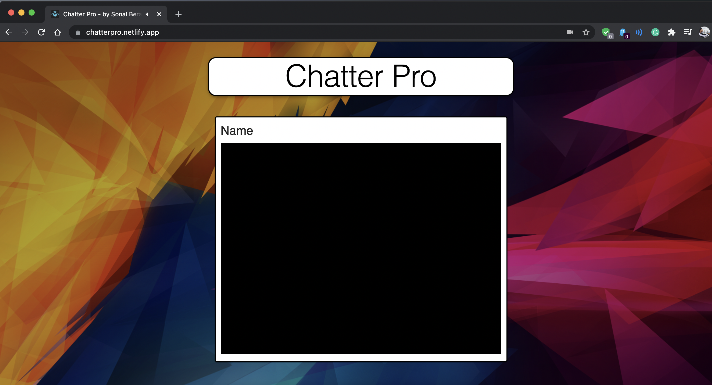

# chatter-pro

A video chat application modelled on the likes of Omegle/Zoom, with unique meeting ID. Users can initiate a personal user ID to prevent unauhorised access of miscreants into the meet.

Try out the service : [ChatterPro](https://chatterpro.netlify.app/ "ChatterPro- by Sonal Bera")

